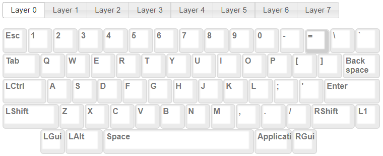
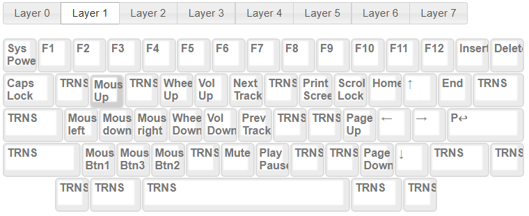

# HHKB Custom Layout
My own keyboard customization layout  

## info: 
- Layout editor on : [source](http://www.tmk-kbd.com/tmk_keyboard/editor/unimap/?hhkb)
- Flash using FLIP : [source](https://www.softpedia.com/get/Programming/Other-Programming-Files/Atmel-Flip.shtml)

## Layout
### Layer 0

### Layer 1

